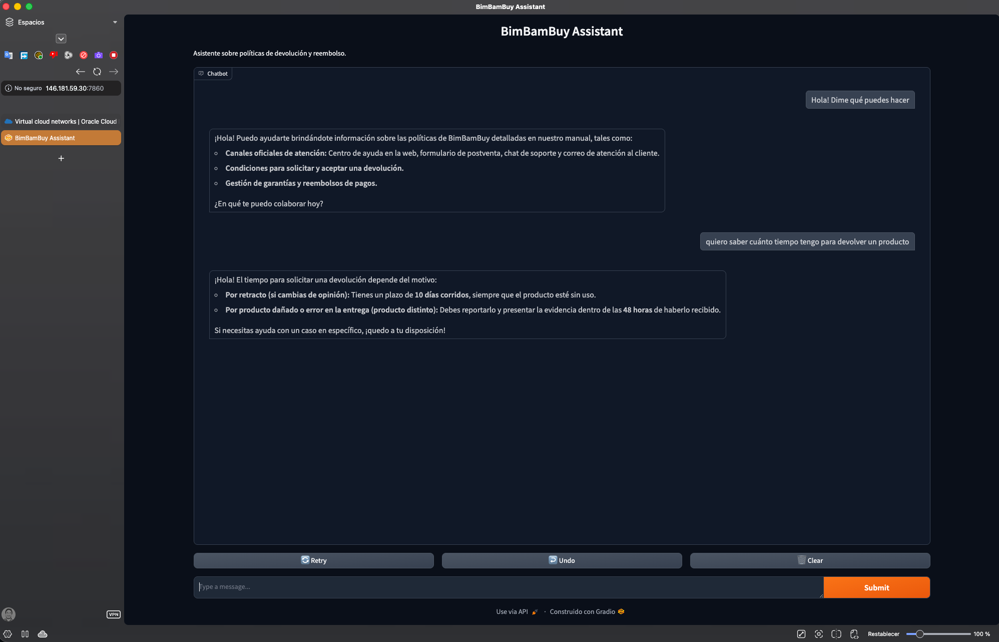

# README - BimBamBuy Agent

## Descripción

BimBamBuy Agent es un asistente conversacional construido con Python, LangChain, Gemini y Gradio. Su objetivo es responder preguntas sobre las políticas de devolución y reembolso de la tienda BimBamBuy a partir del contenido de un PDF cargado localmente.

El proyecto implementa un flujo RAG (Retrieval-Augmented Generation): primero carga y divide el PDF en fragmentos, luego genera embeddings locales con un modelo de Hugging Face, guarda o reutiliza un índice vectorial con FAISS y finalmente consulta Gemini para redactar la respuesta final usando solo el contexto recuperado.

## Tecnologías usadas

| Tecnología | Rol en el proyecto |
|------------|--------------------|
| Python | Lenguaje principal de implementación |
| Gradio | Interfaz web para conversar con el asistente |
| LangChain | Orquestación del flujo RAG y del retriever |
| Gemini | Modelo LLM para generar la respuesta final |
| Hugging Face / sentence-transformers | Generación local de embeddings |
| FAISS | Almacenamiento y búsqueda vectorial local |
| PyPDF | Lectura del PDF de políticas |

## Estructura del proyecto

```bash
bimbambuy-agent/
├── app.py
├── config.py
├── requirements.txt
├── .env
├── data/
│   └── PDF_politicas_devoluciones_TiendaBimBamBuy.pdf
├── vectorstore/
│   └── faiss_index/
└── src/
    ├── chain.py
    ├── embeddings.py
    ├── loaders.py
    ├── prompts.py
    ├── splitter.py
    └── vectorstore.py
```

## Cómo funciona

1. `app.py` carga variables de entorno y valida la clave `GOOGLE_API_KEY`.
2. El PDF de políticas se carga con `PyPDFLoader` y se divide en fragmentos más pequeños.
3. Cada fragmento se vectoriza con embeddings locales de Hugging Face.
4. Los vectores se guardan en FAISS para permitir recuperación semántica rápida.
5. Cuando el usuario hace una pregunta, el retriever busca los fragmentos más relevantes.
6. Gemini recibe la pregunta y el contexto recuperado para construir la respuesta final.

## Requisitos previos

- Python 3.11.
- Una clave válida de Google AI Studio para Gemini.
- El archivo PDF de políticas ubicado dentro de la carpeta `data/`.

## Instalación local

```bash
python3.11 -m venv .venv
source .venv/bin/activate
python -m pip install --upgrade pip
pip install -r requirements.txt
```

Crear un archivo `.env` con este contenido:

```env
GOOGLE_API_KEY=tu_api_key_aqui
```

## Ejecución

```bash
python app.py
```

Al iniciar correctamente, Gradio levanta una interfaz local en `http://127.0.0.1:7860` y puede generar un enlace público temporal para pruebas rápidas.

## Configuración principal

El archivo `config.py` define las rutas y parámetros principales del sistema:

- `PDF_PATH`: ruta del PDF de políticas.
- `INDEX_DIR`: ubicación del índice FAISS.
- `MODEL_NAME`: modelo Gemini utilizado.
- `CHUNK_SIZE`: tamaño de cada fragmento.
- `CHUNK_OVERLAP`: solapamiento entre fragmentos.
- `TOP_K`: número de fragmentos recuperados por consulta.

Estos parámetros controlan directamente la calidad de la recuperación y el comportamiento del bot dentro del flujo RAG.

## Embeddings locales

El proyecto usa `sentence-transformers/all-MiniLM-L6-v2` a través de Hugging Face porque ofrece una buena relación entre velocidad, consumo de recursos y calidad de búsqueda semántica para un RAG local. Esto permite evitar el costo y la dependencia de una API externa para generar embeddings, además de mantener el contenido del PDF en un flujo local durante la indexación.

## Comportamiento esperado del bot

El asistente debe responder únicamente con base en el contexto recuperado del PDF. Si la respuesta no aparece en la política, debe indicarlo de forma explícita y no inventar información.

## Posibles mejoras

- Agregar memoria conversacional.
- Incluir citas o referencias al fragmento del PDF usado en cada respuesta.
- Crear tests automáticos para validar preguntas frecuentes.

## Entregable del challenge

Este proyecto cumple con el objetivo de construir un agente conversacional que consulta un documento PDF de políticas, recupera contexto con un sistema RAG y responde mediante una interfaz web simple. La arquitectura elegida es apropiada para una primera versión local y deja una base razonable para un despliegue posterior en la nube.

## Evidencias del Deploy en OCI

Enlace público a la aplicación desplegada:
http://146.181.59.30:7860

Screenshot:


#### Ajuste necesario para despliegue en OCI

Originalmente la aplicación estaba configurada para ejecutarse solo en localhost:

```python
if __name__ == "__main__":
    iface.launch(
        server_name="127.0.0.1",
        server_port=7860,
        share=True,
    )
```

Para hacerla accesible desde la IP pública de la instancia en OCI, fue necesario reemplazar esa configuración por:

```python
if __name__ == "__main__":
    iface.launch(
        server_name="0.0.0.0",
        server_port=7860,
        share=False,
    )
```

Con este cambio, la aplicación quedó escuchando en todas las interfaces de red de la VM y pudo ser accedida externamente desde el navegador.

Además:
- se habilitó el puerto `7860` en la red de OCI,
- se agregó una regla persistente en `iptables` para permitir tráfico entrante al puerto `7860`,
- y se configuró un servicio `systemd` para que la aplicación inicie automáticamente al arrancar la VM.

De esta forma, la aplicación sigue disponible incluso después de cerrar la sesión SSH o reiniciar la instancia.